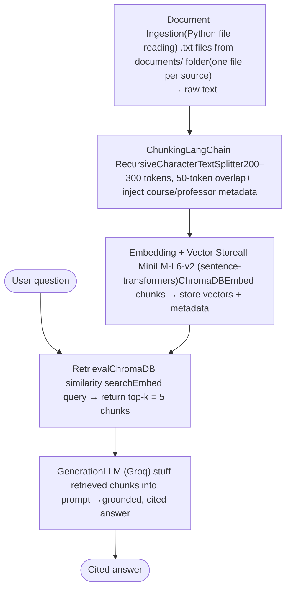

# Project 1 Planning: The Unofficial Guide

> Write this document before you write any pipeline code.
> Your spec and architecture diagram are what you'll use to direct AI tools (Claude, Copilot, etc.) to generate your implementation — the more specific they are, the more useful the generated code will be.
> Update the Retrieval Approach and Chunking Strategy sections if you change your approach during implementation.
> Update this file before starting any stretch features.

---

## Domain

<!-- What domain did you choose? Why is this knowledge valuable and hard to find through official channels? -->
Professor reviews are hard to find on official and most students may not give 
their honest reviews thinking that a negative review might affect their grade.

---

## Documents

<!-- List your specific sources: URLs, subreddit names, forum threads, or file descriptions.
     Aim for at least 10 sources that together cover different subtopics or perspectives within your domain. -->

| # | Source | Description | URL or location |
|---|--------|-------------|-----------------|
| 1 | Rate My Professors — Northeastern University CS department | A platform with reviews about Professors | https://www.ratemyprofessors.com/search/professors/696?q=*&did=11 |
| 2 | Subreddit NEU | Unofficial news and discussion of interest to students, faculty, employees, and neighbors of Northeastern University in Boston, MA | https://www.reddit.com/r/NEU/ |
| 3 | Studocu | Student written notes and documents for a course | https://www.studocu.com/en-us |
| 4 | r/cscareerquestions — class recommendations threads | Career-oriented students share which CS courses and professors gave them the most practical skills | https://www.reddit.com/r/cscareerquestions/search/?q=which+professor+class+recommend |
| 5 | RateMyCourses | https://www.ratemycourses.io/neu | A platform to see the ranking of courses at Northeastern University |
| 6 | NEU CS / Khoury Discord servers — #course-advice channels | Public NEU and Khoury student Discord servers with live discussions about academics | discord.gg/neu (exported #khoury-courses or #cs-advice channel logs) |
| 7 | Coursicle NEU — professor pages with Fall 2026 sections | https://www.coursicle.com/neu/professors/ | Lists every NEU professor with the courses they're currently teaching, plus student-submitted notes |
| 8 | Collegedunia — NEU MS CS student reviews | Long-form verified reviews from current and former NEU MS CS students covering faculty quality, course difficulty, and co-op outcomes | https://s3.collegedunia.com/usa/university/1020-northeastern-university-boston/reviews |
| 9 | r/NEU — co-op and course planning threads | Threads where students ask which courses to take before a specific co-op track (SWE, ML, security) | https://www.reddit.com/r/NEU/search/?q=which+class+course+recommendation&sort=top |
| 10 | The Grad Café — NEU CS program experience threads | Forum where students post detailed accounts of their NEU CS/Khoury experience, course difficulty, professor quality, and co-op outcomes. Fully public, no login required, and skews toward candid long-form posts from grad students. | https://forum.thegradcafe.com/search/?q=northeastern+computer+science |

---

## Chunking Strategy

<!-- How will you split documents into chunks?
     State your chunk size (in tokens or characters), overlap size, and explain why those
     numbers fit the structure of your documents.
     A review-heavy corpus warrants different chunking than a long FAQ. -->

**Chunk size:** 200–300 tokens

**Overlap:** 50 tokens

**Reasoning:** The corpus is review-heavy — most sources (RMP, RateMyCourses, r/NEU,Grad Café) consist of short, self-contained student opinions that naturally fit within200–300 tokens. This size keeps each chunk focused on a single professor or coursewithout mixing opinions across reviews. For longer structured sources (Collegedunia, Studocu, Coursicle), 300 tokens maps roughly to one section (e.g. a "Faculty" or "Curriculum" paragraph), preserving topical coherence. The 50-token overlap prevents facts that straddle a chunk boundary — such as a professor's name stated in one sentence and their grading policy described in the next — from becoming unsearchable.

---

## Retrieval Approach

<!-- Which embedding model are you using (e.g., all-MiniLM-L6-v2 via sentence-transformers)?
     How many chunks will you retrieve per query (top-k)?
     If you were deploying this for real users and cost wasn't a constraint, what tradeoffs
     would you weigh in choosing a different embedding model — context length, multilingual
     support, accuracy on domain-specific text, latency? -->

**Embedding model:** all-MiniLM-L6-v2 via sentence-transformers

**Top-k:** 5

**Production tradeoff reflection:** all-MiniLM-L6-v2 is a practical first choice — it
runs locally, is fast, and has no per-query cost. But it has a 256-token context window,
which means any chunk near the 300-token ceiling gets silently truncated before
embedding. For this project it's acceptable in my opinion.

Context length becomes a real constraint if sources like Studocu or Collegedunia
produce chunks that exceed 256 tokens after overlap. Models like text-embedding-3-small
support up to 8191 tokens, eliminating truncation risk entirely without sacrificing much
speed.

Multilingual support is low priority here since the corpus is English-only, but worth
revisiting if the system were extended to serve NEU's large international student
population who may write reviews in mixed-language code-switching.

Top-k of 5 balances recall against context window pressure on the generation side — 
retrieving more chunks risks flooding the prompt with redundant reviews about the same
professor, which adds noise without improving answer quality.

---

## Evaluation Plan

<!-- List your 5 test questions with their expected correct answers.
     Questions should be specific enough that you can judge whether the system's response
     is right or wrong. "What are good dining halls?" is too vague.
     "What do students say about wait times at [dining hall name] during lunch?" is testable. -->

| # | Question | Expected answer |
|---|----------|-----------------|
| 1 | What do students say about the workload in CS 3500 (Object-Oriented Design)? | Reviews describe OOD as heavy/demanding with a significant project load; students advise starting assignments early. Should cite RateMyCourses or RMP reviews mentioning workload, not just give a generic answer | 
| 2 | Which CS professor is mentioned as giving strong or useful exam reviews? | Vidoje (Vido) Mihajlovic — a CS 3500 review specifically praises his exam reviews and recommends taking him if possible. Should cite the RateMyCourses CS 3500 review |
| 3 | Do students recommend Northeastern's CS program for co-op and job outcomes? | Yes — multiple Collegedunia/Grad Café reviews highlight the co-op program as a key strength, with students reporting 2–3 job offers and strong industry-oriented curriculum. Should cite at least one grad-student review. |
| 4 | How difficult is it to get good grades in NEU's CS master's courses according to students?  |  Mixed: some students say scoring well is "not at all difficult" with effort, others describe courses as demanding and project-heavy requiring significant time. A correct answer should surface this disagreement rather than pick one side. |
| 5 | What is Professor Karl Lieberherr's reputation among CS students? | Lower-rated — RMP shows ~2.4 quality with only ~27% "would take again" and high difficulty (~4/5). A correct answer should reflect the negative/mixed sentiment and cite the RMP rating. |

---

## Anticipated Challenges

<!-- What could go wrong? Name at least two specific risks with reasoning.
     Consider: noisy or inconsistent documents, missing source attribution, off-topic
     retrieval, chunks that split key information across boundaries. -->

1.  **Conflicting reviews retrieved together:** Student opinions on the same professor or
   course often disagree (one calls a course fair, another brutal). The system may average
   them into a vague answer or pick one side, misrepresenting the real spread of opinion.

2. **Implicit entity references break retrieval:** Reviews say "OOD" or "Fundies" without
   stating the course code, so a query using the official name ("CS 3500") may miss
   relevant chunks unless we provide exact context before embedding.

---

## Architecture

<!-- Draw a diagram of your pipeline showing the five stages:
     Document Ingestion → Chunking → Embedding + Vector Store → Retrieval → Generation
     Label each stage with the tool or library you're using.
     You can use ASCII art, a Mermaid diagram, or embed a sketch as an image.
     You'll use this diagram as context when prompting AI tools to implement each stage. -->

---

## AI Tool Plan

<!-- For each part of the pipeline below, describe:
     - Which AI tool you plan to use (Claude, Copilot, ChatGPT, etc.)
     - What you'll give it as input (which sections of this planning.md, which requirements)
     - What you expect it to produce
     - How you'll verify the output matches your spec

     "I'll use AI to help me code" is not a plan.
     "I'll give Claude my Chunking Strategy section and ask it to implement chunk_text()
     with my specified chunk size and overlap" is a plan. -->

**Milestone 3 — Ingestion and chunking:**
I'll give Groq my source list and Chunking Strategy section and ask it to write a loader
that reads the .txt files from my documents/ folder and a chunk_text() function with
my 300-token/50-overlap spec; I'll verify by checking chunk sizes and metadata on a sample.

**Milestone 4 — Embedding and retrieval:**
I'll give Groq my Retrieval Approach section and ask it to embed chunks with
all-MiniLM-L6-v2 into ChromaDB and write a retrieve(query, k=5) function;
I'll verify by running my 5 test questions and checking the returned chunks are relevant.

**Milestone 5 — Generation and interface:**
I'll ask Groq to write a grounded, cited prompt template plus a simple interface,
I'll ask Claude (as my coding assistant) to write a grounded, cited prompt template plus a simple interface, using Groq (llama-3.3-70b-versatile, free tier) as the LLM that generates answers; I'll verify with my Evaluation Plan, checking answers are cited and match expected results.